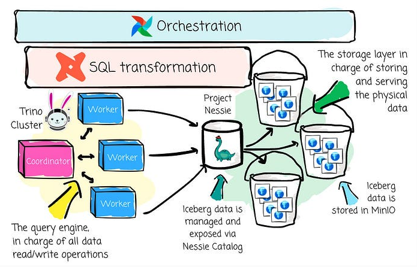
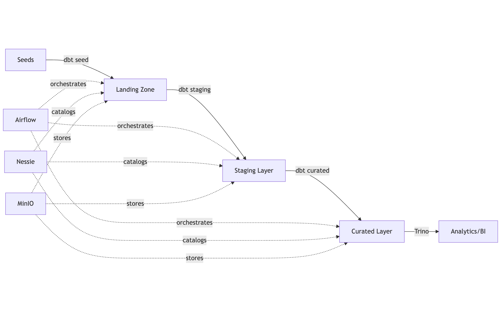

# 🏔️ Local Lakehouse

> **A containerized data lakehouse for local development and testing**

Modern data lakehouse environment combining **Airflow orchestration**, **dbt transformations**, **Trino analytics**, and
**Iceberg tables** on **MinIO object storage**—all running locally with Docker.

[](https://www.python.org/downloads/)
[](https://github.com/astral-sh/ruff)
[](https://github.com/pre-commit/pre-commit)
[](https://www.docker.com/)

---

## 📋 Table of Contents

- [🏔️ Local Lakehouse](#%EF%B8%8F-local-lakehouse)
  - [📋 Table of Contents](#-table-of-contents)
  - [🏗️ Architecture](#%EF%B8%8F-architecture)
    - [Data Flow](#data-flow)
  - [✨ Features](#-features)
    - [Core Capabilities](#core-capabilities)
    - [Developer Experience](#developer-experience)
    - [Data Platform Features](#data-platform-features)
  - [🛠️ Technology Stack](#%EF%B8%8F-technology-stack)
    - [Data Platform](#data-platform)
    - [Development & Operations](#development--operations)
  - [📂 Project Structure](#-project-structure)
  - [📋 Prerequisites](#-prerequisites)
    - [System Requirements](#system-requirements)
    - [Verify Installation](#verify-installation)
  - [🚀 Quick Start](#-quick-start)
    - [1. Clone the Repository](#1-clone-the-repository)
    - [2. Set Up Development Environment](#2-set-up-development-environment)
    - [3. Start All Services](#3-start-all-services)
    - [4. Access the UIs](#4-access-the-uis)
    - [5. Run Your First Pipeline](#5-run-your-first-pipeline)
    - [6. Verify the Results](#6-verify-the-results)
  - [📖 Usage](#-usage)
    - [Service Management](#service-management)
    - [Data Operations](#data-operations)
      - [MinIO (Object Storage)](#minio-object-storage)
      - [Trino (Query Engine)](#trino-query-engine)
    - [dbt Operations](#dbt-operations)
    - [Airflow Operations](#airflow-operations)
  - [🎨 Code Quality](#-code-quality)
    - [Linting with Ruff](#linting-with-ruff)
    - [Type Checking with MyPy](#type-checking-with-mypy)
    - [Pre-commit Hooks](#pre-commit-hooks)
  - [🧪 Testing](#-testing)
    - [Unit Tests](#unit-tests)
    - [DAG Validation](#dag-validation)
    - [dbt Tests](#dbt-tests)
    - [CI Pipeline](#ci-pipeline)
  - [🐛 Troubleshooting](#-troubleshooting)
    - [Services Won't Start](#services-wont-start)
    - [Airflow DAGs Not Appearing](#airflow-dags-not-appearing)
    - [Trino Connection Errors](#trino-connection-errors)
    - [dbt Connection Issues](#dbt-connection-issues)
    - [Memory Issues](#memory-issues)
  - [📚 Additional Resources](#-additional-resources)
    - [Documentation](#documentation)
  - [⭐ Star History](#-star-history)

---

## 🏗️ Architecture



```
┌────────────────────────────────────────────────────────────────┐
│                     ORCHESTRATION LAYER                        │
│  ┌────────────────────────────────────────────────────────┐    │
│  │  Apache Airflow (Scheduler + Worker + Webserver)       │    │
│  │  • DAG orchestration                                   │    │
│  │  • Custom dbt operators                                │    │
│  │  • Task scheduling & monitoring                        │    │
│  └────────────────────────────────────────────────────────┘    │
└────────────────────────────────────────────────────────────────┘
                              ↓
┌────────────────────────────────────────────────────────────────┐
│                    TRANSFORMATION LAYER                        │
│  ┌────────────────────────────────────────────────────────┐    │
│  │  dbt Core                                              │    │
│  │  • Seeds (raw data)                                    │    │
│  │  • Staging models (cleaned data)                       │    │
│  │  • Curated models (analytics-ready)                    │    │
│  │  • Data quality tests                                  │    │
│  └────────────────────────────────────────────────────────┘    │
└────────────────────────────────────────────────────────────────┘
                              ↓
┌────────────────────────────────────────────────────────────────┐
│                      QUERY ENGINE LAYER                        │
│  ┌────────────────────────────────────────────────────────┐    │
│  │  Trino (Coordinator + Workers)                         │    │
│  │  • Distributed SQL queries                             │    │
│  │  • Iceberg table operations                            │    │
│  │  • ACID transactions                                   │    │
│  └────────────────────────────────────────────────────────┘    │
└────────────────────────────────────────────────────────────────┘
                              ↓
┌────────────────────────────────────────────────────────────────┐
│                     CATALOG & STORAGE LAYER                    │
│  ┌──────────────────────┐    ┌──────────────────────────┐      │
│  │  Nessie Catalog      │    │  MinIO Object Storage    │      │
│  │  • Git-like versions │    │  • S3-compatible API     │      │
│  │  • Branch/tag tables │    │  • Parquet file storage  │      │
│  │  • Metadata tracking │    │  • Iceberg data files    │      │
│  └──────────────────────┘    └──────────────────────────┘      │
└────────────────────────────────────────────────────────────────┘

                    Apache Iceberg Table Format
      (Unified metadata for ACID transactions & time travel)
```

---

### Data Flow



---

## ✨ Features

### Core Capabilities

- ✅ **Full Lakehouse Stack**: Complete integration of Airflow, dbt, Trino, Iceberg, Nessie, and MinIO
- ✅ **Local Development**: Everything runs in Docker containers—no cloud accounts needed
- ✅ **Data Versioning**: Git-like semantics for data with Nessie catalog (branch, merge, time travel)
- ✅ **ACID Transactions**: Full ACID compliance powered by Apache Iceberg table format
- ✅ **Modern Data Transformations**: dbt Core with Trino adapter for SQL-based ELT pipelines

### Developer Experience

- ✅ **Workflow Orchestration**: Apache Airflow DAGs with custom dbt operators
- ✅ **Code Quality Tools**: Ruff linting, MyPy type checking, pre-commit hooks
- ✅ **Automated Testing**: pytest unit tests, Airflow DAG validation, dbt data quality tests
- ✅ **Easy Management**: Comprehensive Makefile with 30+ commands
- ✅ **Production Patterns**: Industry best practices for data engineering projects

### Data Platform Features

- ✅ **S3-Compatible Storage**: MinIO for object storage with web UI
- ✅ **Distributed Query Engine**: Trino with coordinator + worker architecture
- ✅ **Layered Data Architecture**: Landing → Staging → Curated zones
- ✅ **Schema Evolution**: Handle schema changes without breaking pipelines
- ✅ **Time Travel Queries**: Query historical data snapshots with Iceberg

---

## 🛠️ Technology Stack

### Data Platform

- **Apache Airflow** (2.8+) - Workflow orchestration and scheduling
- **dbt Core** (1.7+) - SQL-based data transformations
- **Trino** (435+) - Distributed SQL query engine
- **Apache Iceberg** (1.4+) - Open table format with ACID transactions
- **Nessie** (0.74+) - Git-like data catalog and versioning
- **MinIO** (Latest) - S3-compatible object storage

### Development & Operations

- **Docker & Docker Compose** - Containerized services
- **Python 3.11+** - Primary programming language
- **Poetry** - Python dependency management
- **Ruff** - Lightning-fast Python linter and formatter
- **MyPy** - Static type checker
- **pre-commit** - Automated code quality checks
- **pytest** - Testing framework
- **SQLFluff** - SQL linter for dbt models
- **Make** - Command-line task automation

## 📂 Project Structure

```
local_lakehouse/
├── 🐳 docker-compose-airflow.yaml     # Airflow services
├── 🐳 docker-compose-lake.yaml        # MinIO + Nessie
├── 🐳 docker-compose-system.yaml      # Orchestrator
├── 🐳 docker-compose-trino.yaml       # Trino coordinator + workers
├── 🐳 Dockerfile                      # Custom Airflow image
│
├── 📄 .env.example                    # Example environment variables
├── 📄 .gitignore                      # Git ignore file
├── 📄 .mdformat.toml                  # Markdown formatter configuration
├── 📄 .pre-commit-config.yaml         # Pre-commit hooks
├── 📄 .secrets.baseline               # Baseline for secrets
├── 📄 Makefile                        # CLI commands
├── 📄 poetry.lock                     # Poetry lock file
├── 📄 pyproject.toml                  # Python project config
├── 📄 README.md                       # This file
├── 📄 requirements-airflow.txt
├── 📄 requirements-dbt.txt
├── 📄 ruff.toml                       # Linting rules
│
├── 🖼️ assets/                         # Static assets
│   └── ...
│
├── 🎯 dags/                           # Airflow DAGs
│   ├── dbt_dag.py                     # Main orchestration DAG
│   ├── custom_operator/
│   │   └── dbt_operator.py            # Custom dbt operator
│   │
│   └── dbt_trino/                     # dbt project
│       ├── dbt_project.yml
│       ├── profiles.yml
│       ├── seeds/                     # Raw CSV data
│       │   ├── product_categories.csv
│       │   ├── products.csv
│       │   ├── sales.csv
│       │   └── territories.csv
│       │
│       ├── models/
│       │   ├── staging/               # Cleaned data
│       │   │   ├── stg_products.sql
│       │   │   ├── stg_sales.sql
│       │   │   └── stg_territories.sql
│       │   │
│       │   └── curated/               # Analytics-ready
│       │       ├── dim_product.sql
│       │       ├── dim_country.sql
│       │       ├── fact_sale.sql
│       │       └── schema.yml
│       │
│       └── macros/                    # Custom SQL functions
│           └── adjust_schema_name.sql
│
├── ⚙️ trino_config/                   # Trino configuration
│   ├── coordinator/
│   │   ├── config.properties
│   │   └── init.sql                   # Schema initialization
│   ├── worker/
│   │   └── config.properties
│   └── catalog/
│       └── iceberg.properties         # Iceberg catalog config
│
└── 🧪 tests/                          # Test suite
    ├── test_dags.py
    └── test_operators.py
```

## 📋 Prerequisites

Before starting, ensure you have:

- **Docker Desktop** (or Docker Engine + Docker Compose)

  - Version: 20.10+
  - [Install Docker](https://docs.docker.com/get-docker/)

- **Python 3.11+**

  - [Download Python](https://www.python.org/downloads/)

- **Poetry**

  - [Install Poetry](https://python-poetry.org/docs/#installation)

- **Make** (usually pre-installed on macOS/Linux)

  - Windows: Install via [Chocolatey](https://chocolatey.org/) or [WSL](https://docs.microsoft.com/en-us/windows/wsl/)

- **Git**

  - [Install Git](https://git-scm.com/downloads)

### System Requirements

- **RAM**: Minimum 8GB (16GB recommended)
- **CPU**: 4+ cores recommended
- **Disk**: 10GB free space

### Verify Installation

Run these commands to verify everything is installed correctly:

```bash
# Check Docker
docker --version
docker-compose --version

# Check Python
python --version  # or python3 --version

# Check Poetry
poetry --version

# Check Make
make --version

# Check Git
git --version
```

---

## 🚀 Quick Start

### 1. Clone the Repository

```bash
git clone https://github.com/yourusername/local-lakehouse.git
cd local-lakehouse
```

### 2. Configure Environment

Create a `.env` file from the example template. This file will hold your local configuration, including service versions
and credentials.

```bash
cp .env.example .env
```

### 3. Set Up Development Environment

```bash
# Install all dependencies and configure pre-commit hooks
make setup

# Or manually:
poetry install --no-root
poetry run pre-commit install
```

This command will:

- Create a virtual environment
- Install development dependencies (ruff, pre-commit, mypy, pytest)
- Configure pre-commit hooks
- Set up your local environment

### 4. Start All Services

```bash
# Start the entire lakehouse stack
make start
```

Wait 1-2 minutes for all services to initialize.

### 5. Access the UIs

| Service           | URL                      | Credentials                                               |
| ----------------- | ------------------------ | --------------------------------------------------------- |
| **Airflow**       | <http://localhost:8081>  | `admin` / `admin`                                         |
| **Trino**         | <http://localhost:8080>  | No auth                                                   |
| **MinIO Console** | <http://localhost:9001>  | See `.env` file (`MINIO_ROOT_USER`/`MINIO_ROOT_PASSWORD`) |
| **Nessie**        | <http://localhost:19120> | No auth                                                   |

### 6. Run Your First Pipeline

```bash
# Load seed data into the lakehouse
make dbt-seed

# Run transformations
make dbt-run

# Run data quality tests
make dbt-test
```

### 6. Verify the Results

```bash
# List available tables
make list-catalogs
make list-schemas CATALOG=iceberg
make list-tables CATALOG=iceberg SCHEMA=curated

# Open Trino shell for queries
make trino-shell
```

---

## 📖 Usage

### Service Management

```bash
# Start all services
make start

# Stop all services
make stop

# Restart services
make restart

# View logs (follow mode)
make logs

# Check service status
make status

# Full cleanup (stops services + removes volumes)
make clean
```

### Data Operations

#### MinIO (Object Storage)

```bash
# List all buckets
make list-buckets

# Create a new bucket
make create-bucket BUCKET=my-data
```

#### Trino (Query Engine)

```bash
# List catalogs
make list-catalogs

# List schemas in a catalog
make list-schemas CATALOG=iceberg

# List tables in a schema
make list-tables CATALOG=iceberg SCHEMA=staging

# Interactive SQL shell
make trino-shell
```

Example Trino queries:

```sql
-- Show all tables
SHOW TABLES FROM iceberg.curated;

-- Query fact table
SELECT
    territory_name,
    SUM(order_quantity) as total_quantity,
    SUM(line_total) as total_revenue
FROM iceberg.curated.fact_sale
GROUP BY territory_name
ORDER BY total_revenue DESC;

-- Time travel (Iceberg feature)
SELECT * FROM iceberg.curated.fact_sale
FOR SYSTEM_TIME AS OF TIMESTAMP '2024-01-01 00:00:00';
```

### dbt Operations

```bash
# Test dbt connection to Trino
make dbt-debug

# Install dbt packages
make dbt-deps

# Load seed CSV files
make dbt-seed

# Run all transformations
make dbt-run

# Run specific models (requires poetry shell)
poetry shell
cd dags/dbt_trino && dbt run --select staging.*

# Run data quality tests
make dbt-test

# Generate documentation
make dbt-docs
```

### Airflow Operations

1. **Access Airflow UI**: <http://localhost:8080>
2. **Trigger the DAG**: Enable and trigger `dbt_pipeline`
3. **Monitor execution**: View task logs and status
4. **Review XComs**: Check task outputs

---

## 🎨 Code Quality

### Linting with Ruff

[Ruff](https://github.com/astral-sh/ruff) is an extremely fast Python linter (10-100x faster than Flake8).

```bash
# Check for issues
make lint

# Auto-fix issues
make format

# CI mode (no auto-fix)
make check
```

**Configuration**: See `ruff.toml` for rules.

### Type Checking with MyPy

[MyPy](https://mypy-lang.org/) catches type errors before runtime.

```bash
# Run type checker
make type-check
```

**What it catches:**

```pyhon
# ❌ MyPy error: Argument has incompatible type "str"; expected "int"
def add(a: int, b: int) -> int:
    return a + b

result = add(5, "10")  # Caught by MyPy!
```

**Configuration**: See `[tool.mypy]` in `pyproject.toml`.

### Pre-commit Hooks

Automatically enforces code quality on every commit.

```bash
# Manual run on all files
make pre-commit-all

# Manual run on staged files only
make pre-commit

# Update hooks to latest versions
make pre-commit-update
```

Hooks include:

- ✅ Ruff linting & formatting
- ✅ YAML validation
- ✅ SQL formatting (sqlfluff)
- ✅ Secret detection
- ✅ Dockerfile linting
- ✅ Markdown linting

**Configuration**: See `.pre-commit-config.yaml`.

---

## 🧪 Testing

### Unit Tests

```bash
# Run all tests
make test

# Run with coverage report
make test-cov

# View HTML coverage report
open htmlcov/index.html  # macOS
xdg-open htmlcov/index.html  # Linux
start htmlcov/index.html  # Windows
```

### DAG Validation

```bash
# Validate Airflow DAGs (checks for import errors)
make test-dag-validation
```

### dbt Tests

```bash
# Run dbt data quality tests
make dbt-test

# Run specific test (requires poetry shell)
poetry shell
cd dags/dbt_trino && dbt test --select fact_sale
```

### CI Pipeline

```bash
# Run full CI checks locally (before pushing)
make ci-local
```

This runs:

1. Linting (ruff)
2. Type checking (mypy)
3. DAG validation
4. Unit tests

---

## 🐛 Troubleshooting

### Services Won't Start

```bash
# Check Docker resources
docker system df

# Check for stopped containers
docker ps -a

# Check Docker logs for errors
docker-compose -f docker-compose-system.yaml logs

# Clean up old containers/volumes
make clean
docker system prune -a --volumes

# Restart Docker Desktop
```

### Airflow DAGs Not Appearing

```bash
# Check DAG folder permissions
ls -la dags/

# Check Airflow logs
make logs | grep airflow-scheduler

# Validate DAG syntax
make test-dag-validation
```

### Trino Connection Errors

```bash
# Test Trino connectivity
docker exec -it trino-coordinator trino --execute "SELECT 1"

# Check Iceberg catalog config
docker exec -it trino-coordinator cat /etc/trino/catalog/iceberg.properties

# Verify Nessie is running
curl http://localhost:19120/api/v1/trees
```

### dbt Connection Issues

```bash
# Debug dbt connection
make dbt-debug

# Check profiles.yaml
cat dags/dbt_trino/profiles.yaml

# Verify Trino is accessible
docker exec -it trino-coordinator trino --execute "SHOW CATALOGS"
```

### Memory Issues

```bash
# Monitor container memory usage
docker stats

# Increase Docker memory limit in Docker Desktop:
# Settings → Resources → Memory → 8GB+
```

---

## 📚 Additional Resources

### Documentation

- [Apache Airflow Docs](https://airflow.apache.org/docs/)
- [dbt Documentation](https://docs.getdbt.com/)
- [Trino Documentation](https://trino.io/docs/current/)
- [Apache Iceberg Docs](https://iceberg.apache.org/docs/latest/)
- [Nessie Documentation](https://projectnessie.org/docs/)
- [MinIO Documentation](https://min.io/docs/minio/linux/index.html)

---

## ⭐ Star History

If you find this project helpful, please consider giving it a star! ⭐

---

<div align="center">

**[⬆ Back to Top](#-local-lakehouse)**

Made with ❤️ for the data engineering community

</div>
